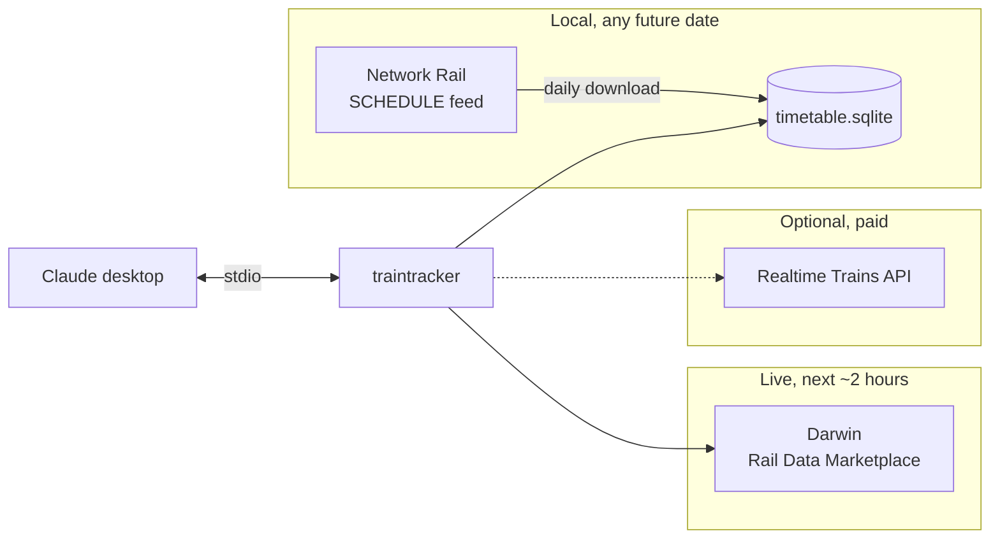
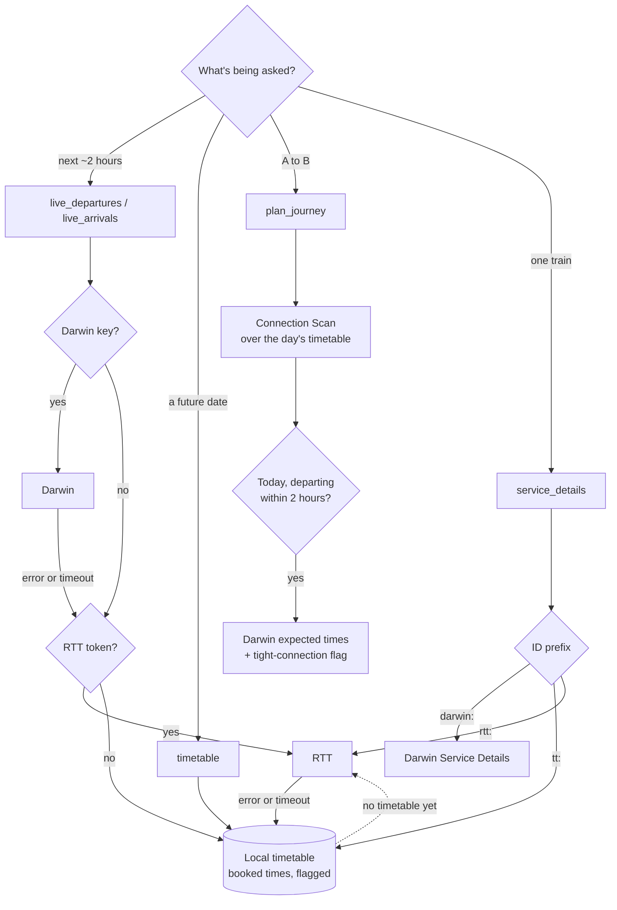

# traintracker

An MCP server that lets Claude answer questions about GB (National Rail) trains: *"when's the next train to Sudbury?"*, *"is the 13:00 from Liverpool Street on time?"*, *"how do I get from Cambridge to Sudbury next Saturday morning?"*

It runs locally on your Mac over stdio and plugs into the Claude desktop app.



## Tools

| Tool | Answers | Data |
|---|---|---|
| `find_station` | "Which Sudbury?" Station names ↔ CRS codes | Bundled station list |
| `live_departures` | Next trains, expected times, platforms, delays, cancellations | Darwin; if it's not set up or fails, RTT, then booked times |
| `departure_platform` | "Which platform is the 13:00 to Colchester?" One train's platform, flagged `live` or `booked` | Darwin (paged); booked platform from the local timetable until the live one is announced |
| `platform_departures` | "What are the next three trains from platform 7?" | Same as `departure_platform` |
| `live_arrivals` | Trains arriving in the next ~2 hours | Darwin arrivals; if not set up or failing, RTT, then booked times |
| `timetable` | Booked departures/arrivals at a station on any date | Local timetable → RTT |
| `service_details` | Every stop for one train | Whichever source issued the ID |
| `plan_journey` | A to B with changes (up to `max_changes`, default 4), incl. cross-London links | Local timetable + Darwin live overlay |
| `data_status` | What's configured, timetable freshness, what's missing | — |

Every tool accepts station names or CRS codes. Ambiguous names ("Sudbury", "Harrow") return the candidates so Claude can ask which one you meant.

## Accounts you need

| # | Account | Needed? | Cost | What it provides | Used for |
|---|---|---|---|---|---|
| 1 | **Rail Data Marketplace** — *Live Departure Board* product | **Yes** for live times | Free | Darwin: National Rail's real-time feed. Departure boards for the next 2 hours with expected times, platforms, delay/cancellation reasons, calling points, station alerts. The same data as station screens. | `live_departures`, live overlay in `plan_journey` |
| 2 | **Network Rail Open Data (NTROD)** — *SCHEDULE* feed | **Yes** for timetables and planning | Free | The full GB passenger timetable from Network Rail's planning system, including short-term changes (engineering works, extra trains, cancellations) once published. Refreshed daily. | `timetable`, `plan_journey`, `service_details` for `tt:` IDs, offline fallback for the live tools |
| 3 | Rail Data Marketplace — *Service Details* product | Optional | Free | Full live calling pattern for a train seen on a Darwin board. | `service_details` for `darwin:` IDs |
| 4 | Rail Data Marketplace — *Live Arrival Board* product | Optional | Free | Darwin arrivals boards. Without it, arrivals fall back to RTT or booked times. | `live_arrivals` |
| 5 | **Realtime Trains** API | Optional | Paid | Live and historical running for any date, detailed calling patterns. Off unless a token is set. | Fallback for live tools and `timetable`; `rtt:` service IDs |

### 1. Rail Data Marketplace (Darwin)

1. Create an account at [raildata.org.uk](https://raildata.org.uk).
2. In the product catalogue, search **"Live Departure Board"** (the LDBWS product, not "Live *Fastest* Departure Boards") and subscribe. Approval for the free tier ranges from instant to a few days.
3. Open the subscribed product → **Specification** tab. Copy the **Consumer key** (not the secret) into `DARWIN_API_KEY`.
4. Check the base URL on that tab matches `DARWIN_DEPARTURES_URL` in `.env.example`. If it differs, set `DARWIN_DEPARTURES_URL` to your value (everything before `/GetDepBoardWithDetails`).
5. *(Optional)* Subscribe to **Service Details** and **Live Arrival Board** the same way. Each product has its own key and URL: set `DARWIN_SERVICE_API_KEY` / `DARWIN_SERVICE_URL` and `DARWIN_ARRIVALS_API_KEY` / `DARWIN_ARRIVALS_URL`.

### 2. Network Rail Open Data (SCHEDULE)

1. Register at the [Network Rail data feeds portal](https://publicdatafeeds.networkrail.co.uk/ntrod/welcome). Activation can take a while.
2. Sign in and check that **SCHEDULE** appears under *Static feeds*.
3. Put your portal username and password in `NR_USERNAME` and `NR_PASSWORD`.
4. If the portal gives a different download link for the *full daily extract, all operators, JSON* than `NR_SCHEDULE_URL` in `.env.example`, set `NR_SCHEDULE_URL` to it.

The server downloads the feed in the background when the local timetable is missing or older than 26 hours. It checks this on start-up and on every tool call, so a server left running for days stays current. If a download fails it keeps serving the old timetable, and `data_status` shows the error. You can also run `traintracker refresh` by hand (see [Commands](#commands)).

### 5. Realtime Trains (optional)

Get a token at [api-portal.rtt.io](https://api-portal.rtt.io). You'll receive either a long-life **access token** (`RTT_ACCESS_TOKEN`) or a **refresh token** (`RTT_REFRESH_TOKEN`); the server handles both. RTT's old v1 API (`api.rtt.io/api/v1`) shuts down on 30 Sep 2026; this server only uses the new API at `data.rtt.io`.

## How each source is used



| Source | Freshness | Coverage | Cached for | Limits to know |
|---|---|---|---|---|
| Darwin | Real time | Now → +2 hours | 20 s | Darwin service IDs expire soon after the train runs |
| Local timetable | Daily (Network Rail publishes ~06:00) | Two days back → end of the published timetable (usually months) | Until the next rebuild | Booked times only; last-minute changes show up in Darwin, not here |
| Realtime Trains | Real time | Past and future, per your token's entitlements | 30 s (near now), 10 min (further out) | Rate limited (e.g. 30/min); paid |

### What the local timetable keeps

The SCHEDULE feed is large (all trains, freight included). On import, traintracker keeps only what a passenger needs:

- Passenger categories only (trains, replacement/timetabled buses, ships). Freight and empty stock are dropped, except overlay and cancellation records, which can stop a passenger train running on a given day.
- Stops with a public time only; junctions and passing points are dropped.
- Schedules that ended more than two days ago are dropped.

For each date it applies Network Rail's precedence rules per train: cancellation (C) beats new (N), which beats overlay (O), which beats permanent (P), and it honours each schedule's running days and date range. Bank-holiday running flags are not applied yet, so on bank holidays check the live board.

### Journey planning

`plan_journey` uses a round-based Connection Scan over every train hop of the day: round *n* finds the earliest arrival using at most *n* trains. That gives the fastest journey and the slower options with fewer changes in one pass, up to `max_changes`. It repeats from just after each departure to find the next few options, then drops any option that another beats on departure, arrival and changes at once, so you're never told to leave earlier than necessary. Results are ordered by arrival, and the fewest-changes option is always included.

- **Minimum change time:** 5 minutes between trains by default (`MIN_INTERCHANGE_MINUTES`). Walk/Tube links already include time to get in and out of stations, so no extra change time is added after them.
- **Cross-London:** the Tube isn't in the rail timetable, so transfers between London terminals (Kings Cross, Liverpool Street, Waterloo, etc.) are approximated: walks under 0.8 km at walking pace plus 5 minutes, otherwise Tube at ~12 minutes plus 3.5 minutes per km. They're labelled `tube (approx.)`.
- **Live overlay:** for today's legs departing within two hours, Darwin's expected times and platforms are added, and `connection_at_risk` is set if a delay or cancellation eats into a change, including one made via a walk/Tube link. If Darwin is down, the plan is still returned without live times.
- The search covers the service day (trains running into the early hours are included); it doesn't carry over to the next morning. Station boards do include trains just after midnight.

## Install

Requires [uv](https://docs.astral.sh/uv/) and Python 3.11+.

```bash
git clone git@github.com:hugorodgerbrown/traintracker.git
cd traintracker
uv sync
cp .env.example .env          # fill in your keys (.env is git-ignored)
uv run traintracker refresh   # first timetable download (a few minutes)
uv run traintracker status
```

### Add to the Claude desktop app

Edit `~/Library/Application Support/Claude/claude_desktop_config.json`. Use the full path to `uv` (run `which uv`), because the app doesn't use your shell's `PATH`:

```json
{
  "mcpServers": {
    "traintracker": {
      "command": "/Users/hugo/.local/bin/uv",
      "args": ["--directory", "/Users/hugo/Projects/traintracker", "run", "traintracker"]
    }
  }
}
```

`--directory` makes the project folder the working directory, so the server reads your keys from `.env` there. Keys can go in an `"env"` block in this file instead; real environment variables take precedence over `.env`.

Restart the Claude app, then ask *"what's the status of traintracker's data sources?"* to check everything is connected.

## Configuration

All configuration is by environment variable, read from `.env` in the project folder if present. See [`.env.example`](.env.example).

| Variable | Default | Purpose |
|---|---|---|
| `DARWIN_API_KEY` | — | Live Departure Board consumer key |
| `DARWIN_DEPARTURES_URL` | RDM LDBWS URL | Override if your Specification tab differs |
| `DARWIN_SERVICE_API_KEY` / `DARWIN_SERVICE_URL` | board key / RDM URL | Service Details product |
| `DARWIN_ARRIVALS_API_KEY` / `DARWIN_ARRIVALS_URL` | — | Live Arrival Board product |
| `NR_USERNAME` / `NR_PASSWORD` | — | Network Rail data feeds login |
| `NR_SCHEDULE_URL` | full daily JSON extract | Override if the portal gives a different link |
| `RTT_ACCESS_TOKEN` or `RTT_REFRESH_TOKEN` | — | Realtime Trains (optional) |
| `TRAINTRACKER_DATA_DIR` | `$XDG_DATA_HOME/traintracker` if set, else `~/.traintracker` | Where `timetable.sqlite` lives |
| `TIMETABLE_MAX_AGE_HOURS` | `26` | Re-download when older than this |
| `MIN_INTERCHANGE_MINUTES` | `5` | Minimum change time for planning |
| `HTTP_TIMEOUT_SECONDS` | `15` | Upstream request timeout |

## Commands

| Command | Does |
|---|---|
| `traintracker` | Run the MCP server on stdio (what Claude runs) |
| `traintracker refresh` | Download the SCHEDULE feed and rebuild the timetable |
| `traintracker import FILE.json.gz` | Build the timetable from a feed file you downloaded yourself |
| `traintracker status` | Show configured sources and timetable details |

Logs go to stderr; stdout carries the MCP protocol.

## Limitations

- **Past running times** ("was the 08:00 late yesterday?") need Realtime Trains. Darwin only covers now → +2 hours, and the timetable is booked times.
- **Fares** aren't included.
- **Tube/bus/tram** aren't in the timetable beyond the approximate London terminal links.
- **Engineering works** appear in the timetable once Network Rail publishes them (usually well ahead), and in Darwin on the day.

## Development

```bash
uv sync
uv run pytest          # 62 tests: importer, STP rules, planner, download, clients, tools end to end
uv run ruff check src tests
uv run mypy            # strict
```

Tests use a synthetic SCHEDULE feed in Network Rail's JSON format (`tests/feedgen.py`) and API fixtures shaped on the published Darwin and RTT schemas. They aren't live recordings, so the first run against real services is the final check.

```
src/traintracker/
  server.py      MCP tools, source fallback, live overlay, CLI
  timetable.py   SCHEDULE importer and SQLite queries (STP resolution)
  planner.py     Connection Scan journey planner, London links
  darwin.py      Rail Data Marketplace LDBWS client
  rtt.py         Realtime Trains client (optional)
  stations.py    Station search and name resolution
  models.py      Output models shared by all sources
```

## Data and licences

- Darwin data via the Rail Data Marketplace, and Network Rail data feeds, are used under the terms you accept when you subscribe. Check those terms before redistributing any output.
- The bundled station list comes from [davwheat/uk-railway-stations](https://github.com/davwheat/uk-railway-stations) under the Open Database License (ODbL).
- Realtime Trains tokens must not be embedded in distributed apps; this server keeps them in your local environment only.

Code: MIT.
